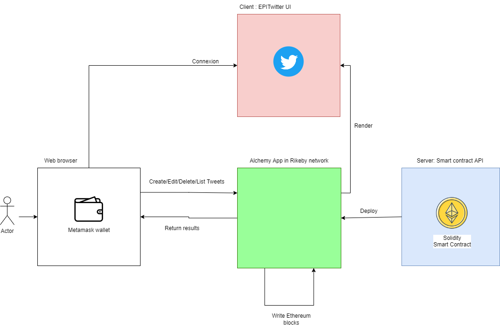

# EPITwitter : 
# A decentralized version of Twitter based en ethereum smart contracts
## Team members: 
* Sergio Kevin MORALES VILLARROEL
* Isaac GUILLERMO GONZALES VIZCARRA 
* Anthony SIAMPIRINGUE    

## Summary:  
The main goal of the project was to have a twitter clone based on Ethereum's smart contracts architecture.  
The creation|modification|deletion of tweets are stored in the blockchain.  
The project has been divided in 2 parts:  
* [The client](https://github.com/sergioKmoralesV/blockchain-light-twitter/tree/main/client#readme), which has been implemented in React.js, is in charge of rendering the UI and querying the API endpoints.  
* [The server](https://github.com/sergioKmoralesV/blockchain-light-twitter/tree/main/server#readme), which contains the Solidity contract, is based on hardhat. The smart contract is hosted on alchemy as an API.

## Prerequisites: 
In order to fully run the application, we need the following elements: 
* A [Metamask](https://metamask.io/) wallet with funds (you can charge [here for Rinkeby](https://rinkebyfaucet.com/),[for Goerli](https://goerlifaucet.com/) and [here for Kovan](https://ethdrop.dev//)) in the given test network. 
* An [Alchemy](https://www.alchemy.com/) account and containing a configured API which contains the server code.  

## Tools used:  
* [Hardhat](https://hardhat.org/), development environment to compile, deploy and test the smart contracts 
* Chai/Mocha, packages to set unit tests on client and server functionalities
* Eslint, open source project for linting Javascript code
* Prettier, to format code  
* Solhint, open source project for linting Solidity code
* Openzeppelin/contracts, libraries allowing to build ready to use smarts contracts based on Ethereum or other blockchains  

## Infrastructure: 

## Configurations and commands to run the client locally and host the server on alchemy  
### Server part:
1. To define your alchemy app address that will be hosting the server, create a .env file from [.env.example](./.env.example)  
2. Command line: npm deploy

### Client part:
1. Command line: npm start
2. Connect to [http://localhost:3000](http://localhost:3000)
