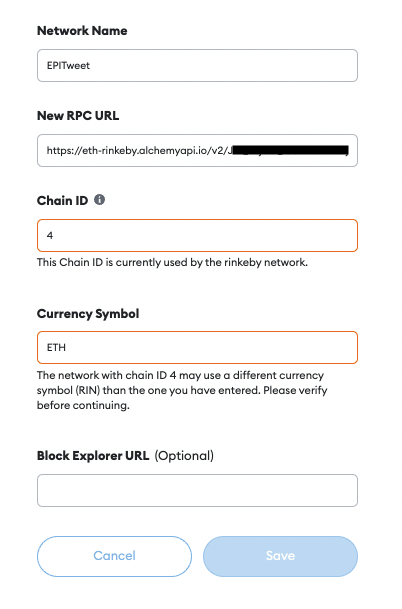

# Light Decentralized Twitter
### Authors ✍️
- Sergio Morales (https://github.com/sergioKmoralesV)
- Isaac Gonzales (https://github.com/Isaacgv)
- Anthony Siampiringue (https://github.com/Anthony-Si)

## Getting started 🏁
### Install dependencies
To start the application make sure you are using the version `> 16` of `node.
To install all the dependencies, please run the command:
```
npm install
```
### Verify my Twitter contract config
Please, verify that your **Smart Contract Address** is well configured in `./src/config.js`.
If the information is incorrect, you won't be able to effectuate any operations.

### Running the application
To run the application, run the command:
```
npm start
```
## Using Smart Contracts 📑
### Create a MetaMask wallet.
For our testing purposes, we are using the plugin of **MetaMask** that you can find here: https://metamask.io/
Make sure that you create your account in `ETH`, since our contracts are running on Ethereum.
### Connect to the network
To connect to the network where your SmartContract is running, please follow the instructions in this page: https://metamask.zendesk.com/hc/en-us/articles/360043227612-How-to-add-a-custom-network-RPC

Here we show you our configuration for our testing Blockchain: </br>


The fields should be filled as follows:
- **Network name:** As you prefer to call the network
- **New RPC URL:** This link corresponds to your Alchemy App link
- **Chain ID:** This corresponds to your main network used (in this case we use 4 for Rinkeby but it has announced that will be deprecated soon)
- **Currency Symbol:** In any case, we use ETH

🚨 **IMPORTANT INFORMATION: DON'T FORGET THAT YOUR NETWORK SHOULD BE THE SAME USED TO DEPLOY YOUR CONTRACT** 🚨